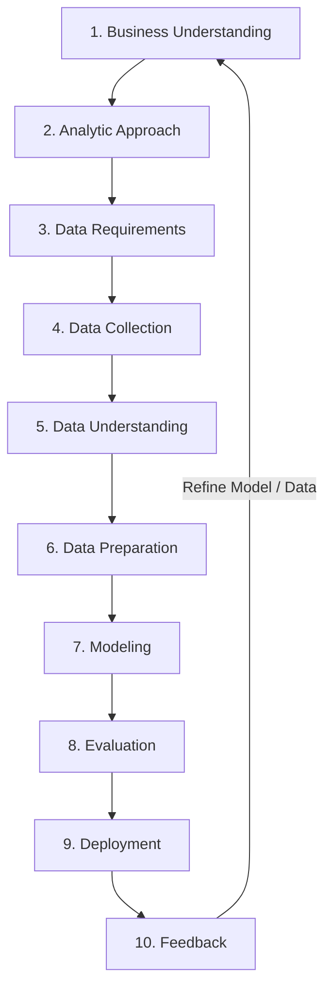

# Data Science Methodology - Complete Study Guide & Course Handbook
**IBM Data Science Professional Certificate - Course 3**  
**Learner**: Pandya Shashank (Pandya Nareshbhai)  
**Status**: Completed & Certified (100% Passed)  

---

## Executive Summary & Course Overview

**Data Science Methodology** outlines the structured, iterative framework required to solve real-world data problems systematically. Developed by John Rollins (IBM Senior Data Scientist), the 10-stage Data Science Methodology ensures that analytical efforts align directly with business goals and produce validated, actionable outcomes.

This course teaches the 10 stages from Business Understanding to Deployment and Feedback, illustrating each stage using real-world medical case studies (e.g., predicting hospital readmission rates for congestive heart failure patients).

---

## The 10 Stages of Data Science Methodology

---

### Stage 1: Business Understanding
- **Objective**: Clearly define the business problem, goal, and metrics for success.
- **Key Questions**: What is the problem you are trying to solve? What is the business impact?
- **Case Study Example**: Reducing 30-day hospital readmission rates for congestive heart failure (CHF) patients to meet healthcare regulations and reduce operational costs.

### Stage 2: Analytic Approach
- **Objective**: Select the appropriate statistical or machine learning technique based on the business question.
- **Decision Criteria**:
  - **Descriptive**: What happened? (Summary statistics, aggregation).
  - **Diagnostic**: Why did it happen? (Correlation analysis, segmentation).
  - **Predictive**: What will happen? (Classification, Regression).
  - **Prescriptive**: What should we do? (Optimization algorithms, Decision Trees).
- **Case Study Selection**: Binary Classification (Predicting whether a patient will be readmitted: $1 = 	ext{Yes}, 0 = 	ext{No}$).

### Stage 3: Data Requirements
- **Objective**: Define the specific data elements, features, formats, and timeframes needed.
- **Key Features Needed**: Patient demographics, clinical diagnoses, lab results, discharge status, prescribed medications, prior admission history.

### Stage 4: Data Collection
- **Objective**: Gather raw data from databases, medical record systems (EHR), APIs, and files.
- **Techniques**: SQL queries, DB2 connection pipelines, data extraction scripts.

### Stage 5: Data Understanding
- **Objective**: Perform Exploratory Data Analysis (EDA) to verify data quality and distributions.
- **Tasks**: Check for missing values, compute summary statistics (mean, median, standard deviation), identify data skewness, plot histograms, heatmap correlations.

### Stage 6: Data Preparation (Wrangling)
- **Objective**: Clean, transform, and format data for model training. (Consumes 70%–80% of data project time).
- **Tasks**:
  - Impute missing values (mean/median/mode substitution).
  - Feature Engineering (derive new variables such as `length_of_stay = discharge_date - admission_date`).
  - One-Hot Encoding for categorical features.
  - Normalization & Scaling (MinMaxScaler, StandardScaler).

### Stage 7: Modeling
- **Objective**: Train predictive machine learning algorithms on training datasets ($70\%-80\%$ split).
- **Algorithms Used**: Decision Tree Classifier, Logistic Regression, Random Forest.

### Stage 8: Evaluation
- **Objective**: Assess model accuracy, stability, and business efficacy on unseen test data ($20\%-30\%$ split).
- **Metrics**: Accuracy, Precision, Recall (Sensitivity), Specificity, ROC-AUC Curve, Confusion Matrix.
- **Case Study Threshold**: High Recall is prioritized in healthcare to avoid false negatives (failing to identify a high-risk patient).

### Stage 9: Deployment
- **Objective**: Integrate the validated model into business operations or clinical decision support tools.
- **Deliverables**: REST APIs, interactive Web App dashboards, automated daily risk score batch scripts.

### Stage 10: Feedback
- **Objective**: Collect operational performance feedback from end-users to continuously refine and retrain the model over time.
- **Feedback Loop**: Monitor model drift, feature decay, and updated patient outcomes to trigger periodic re-training.

---

## Graded Assessment & Exam Review Summary

| Assessment Item | Topics Covered | Score Achieved |
| :--- | :--- | :---: |
| **Graded Quiz 1** | Business Understanding, Analytic Approach, Data Requirements | **100%** |
| **Graded Quiz 2** | Data Collection, Data Understanding, Data Preparation | **100%** |
| **Graded Quiz 3** | Modeling, Evaluation, Deployment & Feedback Loop | **100%** |
| **Final Exam** | Comprehensive 10-Stage Data Science Methodology Case Study | **100%** |
| **Overall Score** | **Full Course Completion** | **100% (Passed)** |

---

## Summary Cheat Sheet & Flashcard Reference

- **Which stage consumes the most time in data science projects?** Data Preparation (Data Wrangling), taking up to 70%–80% of total project effort.
- **Why is feedback essential?** Because real-world data patterns change over time (concept drift), requiring model updates to maintain prediction accuracy.
- **What is the difference between Predictive and Prescriptive Analytics?** Predictive forecasts future outcomes; Prescriptive advises on optimal decisions to achieve a target outcome.

---
*Created and saved in workspace: `Course_3_Data_Science_Methodology\Data_Science_Methodology_Complete_Study_Guide.md`*
